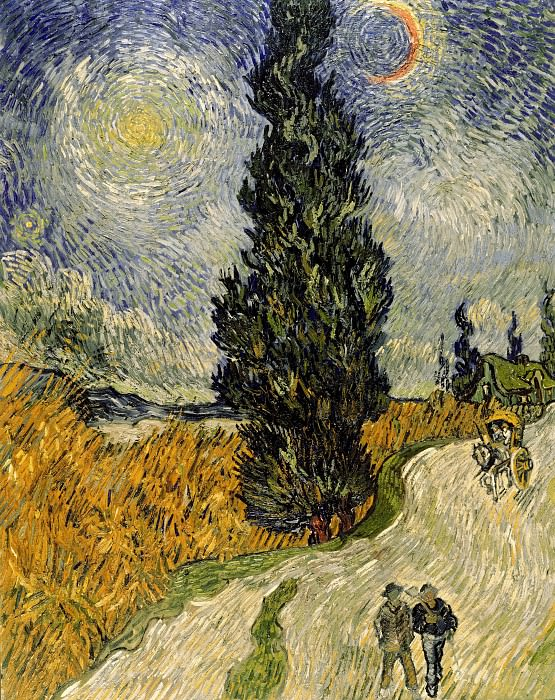

# StylistBot

Bot's username is @ChameleonStylistBot

Examples of input and output images:
 
1. Still life by Vincent van Gogh

 
 
 
2. Still life by Edvard Munch

 
 
 
3. Landscape by Salvador Dali
 

